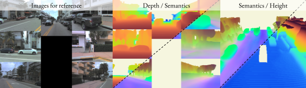

<p align="center">
    <!-- project badges -->
    <a href="https://research.zenseact.com/publications/gasp/"></a>
    <!-- paper badges -->
    <a href="">
        
    </a>
</p>

<div align="center">
<h3 style="font-size:2.0em;">GASP</h3>
<h4 style="font-size:1.5em;">
Unifying Geometric and Semantic Self-Supervised Pre-training for Autonomous Driving
</h4>
</div>
<div align="center">

<div align="center">
<picture>
    <source media="(prefers-color-scheme: dark)" srcset="docs/_static/imgs/dino-feats.png" />
    
</picture>
</div>

[Project page](https://research.zenseact.com/publications/gasp/)  ·
[About](#about)  ·
[TODOs](#todos)

</div>

<h4>Code to be released.</h4>

# About
This is the official repository for _GASP: Unifying Geometric and Semantic Self-Supervised Pre-training for Autonomous Driving_.

### Abstract
Self-supervised pre-training based on next-token prediction has enabled large language models to capture the underlying structure of text, and has led to unprecedented performance on a large array of tasks when applied at scale. Similarly, autonomous driving generates vast amounts of spatiotemporal data, alluding to the possibility of harnessing scale to learn the underlying geometric and semantic structure of the environment and its evolution over time. In this direction, we propose a **g**eometric **a**nd **s**emantic self-supervised **p**re-training method, GASP, that learns a unified representation by predicting, at any queried future point in spacetime, (1) general occupancy, capturing the evolving structure of the 3D scene; (2) ego occupancy, modeling the ego vehicle path through the environment; and (3) distilled high-level features from a vision foundation model. By modeling geometric and semantic 4D occupancy fields instead of raw sensor measurements, the model learns a structured, generalizable representation of the environment and its evolution through time. We validate GASP on multiple autonomous driving benchmarks, demonstrating significant improvements in semantic occupancy forecasting, online mapping, and ego trajectory prediction. Our results demonstrate that continuous 4D geometric and semantic occupancy prediction provides a scalable and effective pre-training paradigm for autonomous driving.


# TODOs
- [ ] Release code
- [ ] Release pre-trained models

## Citation
If you find this work useful, please consider citing:
```bibtex
@article{ljungbergh2025gasp,
  title        = {GASP: Unifying Geometric and Semantic Self-Supervised Pre-training for Autonomous Driving},
  author       = {Ljungbergh, William and Lilja, Adam and Tonderski, Adam and Laveno Ling, Arvid and Lindstr{\"o}m, Carl and Verbeke, Willem and Fu, Junsheng and Petersson, Christoffer and Hammarstrand, Lars and Felsberg, Michael},
  journal      = {},
  year         = {2025}
}
```